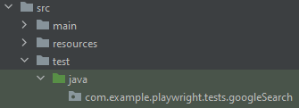
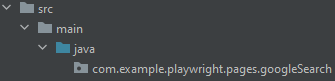
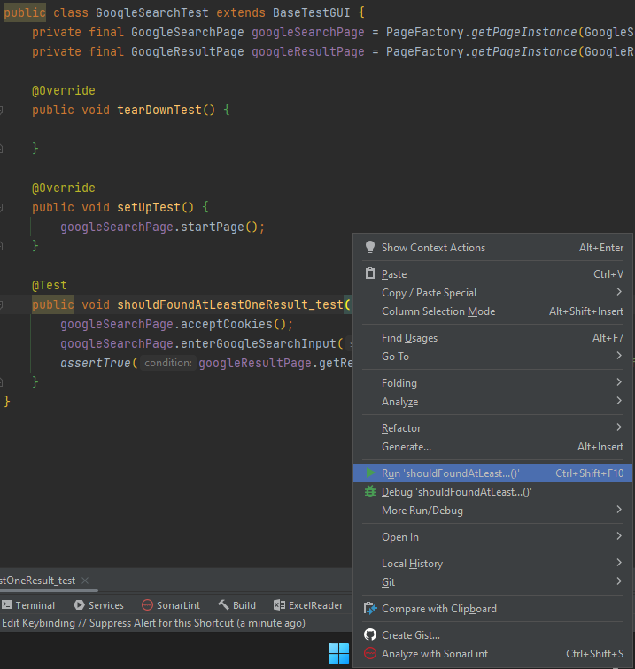

= Sample Walkthrough
This page will guide you through the process of creating a test case. We'll create a very simple test for the Google search engine.

== Test Procedure

We aim to open the Google search engine, input a search query, and submit the form. We expect to see search results listed; otherwise, the test will fail. In summary, the testing process will be as follows:

1. Open google.com.
2. Enter the string "Test" into the search box.
3. Click "Google Search" button".
4. Check if at least one result appears.

== Creating New Packages

We need two new packages: one for new page classes and the other for our test classes.

=== Creating a Package for Test Classes

Open IntelliJ IDEA and use the "Project Explorer" on the left to navigate to:

*Your project* → src/test/java → com.example.playwright → tests

Right-click on "tests," then click "New" → "Package." Name the new package "com.example.playwright.tests.googleSearch."

=== Creating a Package for Page Classes

Navigate to:

*Your project* → src/main/java → com.example.playwright → pages

Right-click on "pages," then click "New" → "Package." Name the new package "com.example.playwright.pages.googleSearch."

== Creating the Page Classes

=== GoogleSearchPage
We need a new Page object to represent the Google Search page.
The page class will be named "GoogleSearchPage" and located in the "com.example.playwright.pages.googleSearch" package.
It should extend the _BasePageGUI_ class and contain the necessary selectors.

The page class represents the Google homepage,
so we need selectors for web elements required in our test case.
In our example, we need two selectors: _Google Search Input_ and _Google Search Button_. These selectors will be implemented as fields.
We can find them using the developer console in Google Chrome.

----
private final String selectorGoogleSearchInput = "[type='search']";
private final String selectorGoogleSearchButton = "[class='FPdoLc lJ9FBc'] .gNO89b";
----

Since Google Search is the first page we want to launch, we implement the `startPage()` method. Inside the method we call `loadPlan()` from the _BasePageGUI_ class and pass the URL, which is defined as a global field.

----
public void startPage() {
        loadPage(url);
 }
----
The main step on this page is to enter text into the search input field and click the "Google Search" button. We already have the necessary selectors, so we implement the method to interact with them, naming it 'enterGoogleSearchInput()'.
----
public void enterGoogleSearchInput(String searchText) {
    getDriver().currentPage().locator(selectorGoogleSearchInput).fill(searchText);
    getDriver().currentPage().locator(selectorGoogleSearchButton).click();
}
----
This page is ready to use; no further actions are needed.

[source,java]
----
public class GoogleSearchPage extends BasePageGUI {
	// URL of the Google search page
	private final String url = GetEnvironmentParam.GOOGLE_URL.getValue();
	// Selectors for web elements
	private final String selectorGoogleSearchInput = "[type='search']";
	private final String selectorGoogleSearchButton = "[class='FPdoLc lJ9FBc'] .gNO89b";

	// Navigate to the Google search page
	public void startPage() {
		loadPage(url);
	}

	// Enter search query and submit the form
	public void enterGoogleSearchInput(String searchText) {
		// Fill the search input with the given text
		getDriver().currentPage()
				.locator(selectorGoogleSearchInput)
				.fill(searchText);

		// Click the Google Search button
		getDriver().currentPage()
				.locator(selectorGoogleSearchButton)
				.click();
	}
}
----

=== GoogleResultPage
When we land on the Google Results page, we need a dedicated class to handle its elements and interactions. This class, named "GoogleResultPage," will be located in the "com.example.playwright.pages.googleSearch" package, just like the "GoogleSearchPage" class.

Similar to the "GoogleSearchPage" class, this class extends the "BasePageGUI" class. It encapsulates the logic for interacting with elements on the Google Results page.

Let's break down the class components:

Selectors: We define a private field named _"selectorSearchResult"_ This selector is responsible for identifying the result items on the Google Results page.

`getResultsNumber()`: This method retrieves the number of search results displayed on the page. Here's how it works:

We retrieve the current page using `getDriver().currentPage()` to work with the active page.
We use waitForSelector with a timeout of 5 seconds to wait for the "searchResult" selector to appear on the page.
The method then returns the count of elements matching the selector, indicating the number of search results.

[source,java]
----
public class GoogleResultPage extends BasePageGUI {
	// Selector for search result items
	private final String selectorSearchResult = "#search .v7W49e > div";

	// Retrieve the number of search results
	public int getResultsNumber() {
		// Get the current page
		Page currentPage = getDriver().currentPage();

		// Wait for the search result selector to appear
		currentPage.waitForSelector(selectorSearchResult, new Page.WaitForSelectorOptions().setTimeout(5000));

		// Count the number of search result items
		return currentPage.querySelectorAll(selectorSearchResult)
				.size();
	}
}
----

== Creating the Test Class

The test class will encompass the entire testing routine for the Google search functionality. Let's walk through the steps to create the test class, named "GoogleSearchTest."

=== GoogleSearchTest
To begin, we'll create a new class within the "googleSearch" package, which we previously established. This class will reside under "src/test/java" and will be named "GoogleSearchTest."

Since "GoogleSearchTest" is a test class, it should extend the BaseTestGUI class. Here is the code structure:

[source,java]
----
public class GoogleSearchTest extends BaseTestGUI {
    // Initialize page instances
    private final GoogleSearchPage googleSearchPage = PageFactory.getPageInstance(GoogleSearchPage.class);
    private final GoogleResultPage googleResultPage = PageFactory.getPageInstance(GoogleResultPage.class);

    @Override
    public void tearDownTest() {
        // Add any cleanup or finalization logic here
    }

    @Override
    public void setUpTest() {
        // Navigate to the Google Search page
        googleSearchPage.startPage();
    }

    @Test
    public void shouldFoundAtLeastOneResult_test() {
        // Enter "Test" and perform search
        googleSearchPage.enterGoogleSearchInput("Test");

        // Assert that at least one search result is found
        assertTrue(googleResultPage.getResultsNumber() > 0, "No results found");
    }
}
----

* Class Setup: We initialize two instances of the page classes using the `PageFactory.getPageInstance()` method. This approach follows the Page Object Model design pattern, making it easy to work with pages.

* `setUpTest()` Method: This method is executed before each test case. In this case, it navigates to the Google Search page using `googleSearchPage.startPage()`;.

* `shouldFoundAtLeastOneResult_test()` Method: This is the actual test method. It starts by entering the search query "Test" and then asserting that there is at least one search result on the Google Results page using assertTrue.

== Test Execution

To run the test using JUnit in IntelliJ Idea, follow these steps:

* Once you're within the "GoogleSearchTest" class, to run `shouldFoundAtLeastOneResult_test()` test method, right-click on it. A context menu will appear.

** Choose "Run": From the context menu, select the option labeled "Run 'shouldFoundAtLeastOneResult_test'". This action triggers the execution of the test method you've selected.
** Press Ctrl + Shift + F10

* After the test execution completes, IntelliJ IDEA will display the test results in the "Run" tool window located at the bottom of the IDE interface.
A green color indicator signifies that the test passed successfully, while a red color indicator indicates that the test encountered failures.

image::images/pw-runTest-green.png[]

This walkthrough should’ve provided you with basic understanding on how the framework can be used to create test cases in Playwright.