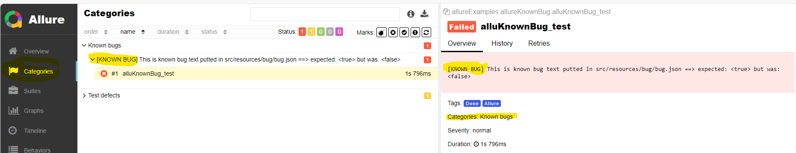

# Playwright project template

The goal is to have open framework based on playwright, junit5 and allure which every project can take and adapt to its needs. 

It is based on

* Playwright: https://playwright.dev/java/docs/intro
* Contains some features 
  * taken from https://github.com/devonfw-forge/mrchecker-source
  * and good practices from projects (Małgorzata Dzienia, Michał Carło, Dariusz Czajkiewicz, and others)

This project template was created January 2024. It is new, first projects will use it soon. Please give feedback what to add & change to: malgorzata.dzienia@capgemini.com 

## Test development:
Before you start with playwright:

* Please check how **codegen** cen help you with test development: https://playwright.dev/java/docs/codegen
  * See the batch how to start it in batch/run_codegen.bat
  * during test development put in your test getPage().pause() to start codegen from this place.
* Please check how traces can be analyzed with **trace viewer**: https://playwright.dev/java/docs/trace-viewer
  * See the batch how to start it in batch/run_show-trace.bat
* See how to create locators: https://playwright.dev/java/docs/locators
  * and how to wait for them https://playwright.dev/java/docs/api/class-elementhandle#element-handle-wait-for-selector
  * Locators, unlike selectors, must be defined, in order to work, when the element is visible on the screen. 
    That's why in the examples there is an initLocators function in the page examples defined, 
    which is called when the page is opened. 

* If you have Xray - check the section below "Create the test template"
* 
## Execute first test

To run tests on ENV1:

    mvn clean test "-Dthread.count=1" -Denv=ENV1 -Dtest=DemoQA* allure:serve

## See reports in target folder
* allure-results : open with mvn allure:serve
* traces : open with trace-viewer see: batch\run_show-trace.bat
* video : play with default video application
* logs

## You can configure some framework behavior by setting the properties

### Playwright properties

Parameters are stored in test/resources/playwright.properties file

        playwright.browser=chromium
        playwright.headless=false
        playwright.browserWidth=1920
        playwright.browserHeight=1200
        playwright.tracing=true
        playwright.videoRecording=true
        playwright.slow.motion=100
        playwright.defaultTimeout=10000
        playwright.ignore.https.errors=true

Video Recording - the records are stored in target/video folder.
Tracing for web browsers test execution is stored in target/traces folder.

You can slow down playwright by setting playwright.slow.motion=100 (playwright will wait given milliseconds between actions)

you can extend the code in PlaywrightFactory.java to add more properties which is needed in your project.

### JUnit5 properties

Parameters are stored in test/resources/junit.platform.properties file

- more description for that you can find: https://junit.org/junit5/docs/current/user-guide/#running-tests-config-params

             junit.jupiter.execution.parallel.enabled=true 
             junit.jupiter.execution.parallel.mode.default=concurrent 
             junit.jupiter.execution.parallel.mode.classes.default=concurrent 
             junit.jupiter.execution.parallel.config.strategy=fixed 
             junit.jupiter.execution.parallel.config.fixed.parallelism=${threads} 

### Allure properties

Parameters are stored in files:

* test/resources/allure.properties
    - Please add here your Jira link for test and bug

              allure.link.tms.pattern=https://PLACEHOLDER.com/browse/{}
              allure.link.issue.pattern=https://PLACEHOLDER.com/browse/{}

# Framework Features

## Environments configuration
Select environment like this:

        mvn test -Denv=ENV1

### Password encryption

This feature is taken direct from MrChecker.
Just read how to use it in batch/encrypt/README

### CSV like in MrChecker
see 
  
    src/test/resources/environments/environment.csv

### HOCON: Advanced JSON/properties/human-friendly configuration (Human-Optimized Config Object Notation)

see https://github.com/lightbend/config/blob/main/HOCON.md

* Supports files in three formats: Java properties, JSON, and a human-friendly JSON superset

Simple example in file (advanced see www): 
        
    src/test/resources/environments/environment.conf

  

## Assertions
### AssertJ as assertion library

Allure steps with assertion will be added automatically if you use .as / .withFailMessage:

         .as(positive text what is checked)
         .withFailMessage(what was wrong in case of failure)

Examples: 

In allure you will get:

and in case of failure, this step is red and the message is concatenated with text form .as and .withFailMessage: 
        
        [Output text should be: Another text to fail check] but is: Invalid username or password!

AssertJ documentation for advanced assertions:
See https://assertj.github.io/doc/#assertj-core

### Playwright assertions
Playwright has assertion library which can assert locators, pages and api responses.
See https://playwright.dev/java/docs/test-assertions

### Junit5 assertions
You can use it, but AssertJ is cooler.

## Use a cool storage functionalities in Playwright to log to tested app ones and reuse authenticated state:

* login to your app and at the end save the authenticated state to file:

	    PlaywrightFactory.getBrowserContext().storageState(new BrowserContext.StorageStateOptions().setPath(Paths.get("target/auth/loggedState.json")));

* Set session storage from file, and reuse it in the beginning of new test instead of log in again.

  	Browser.NewContextOptions options = new Browser.NewContextOptions().setStorageStatePath(Path.of("target/auth/FUXLoggedState.json"));
  	PlaywrightFactory.initBrowserContext(options);

## Waiting
Playwright has implementation of auto-waiting, so in many cases it is enough.

See: https://playwright.dev/java/docs/actionability

### Awaiting library
You can for example wait until assertion is fulfilled.
See: 
* http://www.awaitility.org/
* https://github.com/awaitility/awaitility/wiki/Usage

Example: 

        Awaitility.await()
        .atMost(5, TimeUnit.SECONDS)
        .pollInSameThread()
        .pollInterval(100, TimeUnit.MILLISECONDS)
        .untilAsserted(() -> assertThat(acquiredValue)
        .describedAs("The warning text is not " + textValue)
        .contains(textValue));

## Geolocation and locales

### Geolocation

     var geolocationNewYork = new Geolocation(40.730610, -73.935242);
     Browser.NewContextOptions options = new Browser.NewContextOptions().setGeolocation(geolocationNewYork)
				.setPermissions(List.of("geolocation"));
	 PlaywrightFactory.initBrowserContext(options);
     Page page = getPage();
     // you are in New York

### Locale

     Browser.NewContextOptions options = new Browser.NewContextOptions().setLocale("de_DE");
	 PlaywrightFactory.initBrowserContext(options);
     Page page = getPage();
     // your www is in German language

## Test Suites

To help to select test cases for test execution you can use Suites.

* Test can be tagged

and it will be executed in this suite.

# Xray Integration

## Create the test template to speed up test development.
This is a simple tool to convert csv files with test steps exported from Xray to java test template with allure steps and annotations.

### usage:
* Open your test case in jira
* Click on ... → export to csv over the test steps
* Use default settings and save the file
* Put the file to src/test/resources/xrayManualTests
* Edit com.capgemini.testTemplateGeneratorFromXrayCsv.TestTemplateGeneratorFromXrayCsv.java
  ** INPUT_CSV_FILE_PATH to pick your manual test case for generation
* Run com.capgemini.testTemplateGeneratorFromXrayCsv.TestTemplateGeneratorFromXrayCsv.java 
* Template will be generated into target/testTemplate
* Move it to test package, execute, see allure and fill with implementation

Generated file:

Allure from TestTemplate

Now you can start with test development.

## Known Bugs
to minimize time needed for test report analyse. The known bugs are shown in allure separated folder, and we know that they are not fixed yet, and we don't analyse them again.:
* test/resources/categories.json
    - It is preconfigured to filter know bugs to new "Known Bugs" allure category
      

How to use it:
- Step 0: Put your Jira link in file com.capgemini.framework.allure.listeners.AllureKnownBug:

           final String jiraLink = "LinkToJira/";

- Step 1: Run test execution
- Step 2: Create a bug ticket in Jira for failed test
- Step 3: Edit src/test/resources/bugs/bug.json file and put there created bug
    - BUG_1 is created issueId
    - JIRA-0 is jiraId
    - message is error text

                {
                "issue": "BUG_1",
                "issueStatus": "KNOWN BUG",
                "message": "This is known bug text putted in",
                "tests": [
                "JIRA-0"
                ]
                }

- Step 4: run test execution again and check allure report. If bug is defined well and is still present in application -the Bug will appear in new allure category.

    - Information how to configure more categories: https://allurereport.org/docs/how-it-works-categories-file/
    - you can define there for example technical issues eg. timeout issues - depends on project needs.

## Importing Test Execution Results to Jira:

We use Xray json format to create a test execution result file to upload test execution results to Xray.
https://docs.getxray.app/display/XRAYCLOUD/Using+Xray+JSON+format+to+import+execution+results#UsingXrayJSONformattoimportexecutionresults-JSONformat

This is implemented in com.capgemini.framework.allure.listeners.AllureToXray.

How to use it:

- Step 1:  Run test execution
- Step 2: Check the file target/XRAY/xrayTestExecution.json - here we have the results for all tests which have defined
  JiraId
- Step 3: Open Jira -> Create new execution -> Find the function to import test execution results -> select file created
  in step 2 -> confirm
- Step 4: Your execution is uploaded to Jira. Check also the test execution details for one test, even known bugs
  linked for known bug tests.

## Allure steps numbering

In file com.capgemini.framework.allure.listeners.AllureStepsNumbering we can remove some steps or modify steps as we wish. In this file we are adding numbers before every steps text:

## Selenium grid execution test (will work only on chromium)
See: https://playwright.dev/java/docs/selenium-grid

